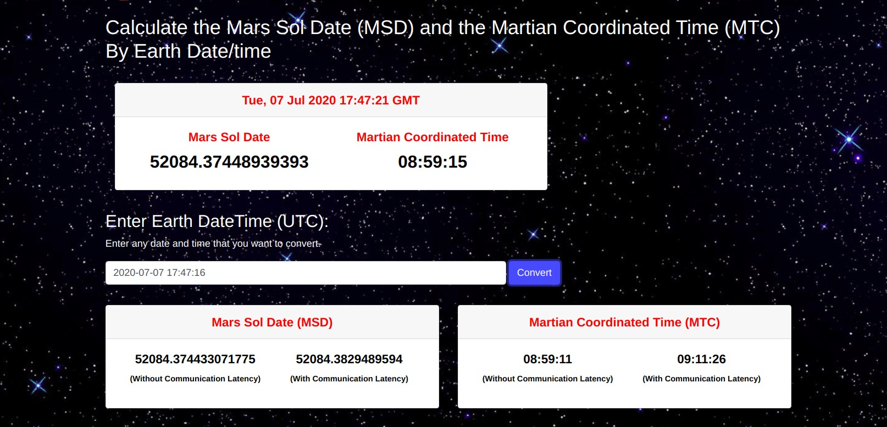

This application is an HTTP based microservice written on PHP that receives
the Earth (UTC) timestamp in seconds as an input and returns two values:
* Mars Sol Date (MSD)
* Martian Coordinated Time (MTC)



### Installation
Add microservice hostname to `/etc/hosts`
```
127.0.0.1 mars-clock.microservice
```

Start docker
```
docker-compose up -d
```

Install composer

```
docker-compose exec php bash
```
```
composer install
```

Navigate to `http://mars-clock.microservice`
